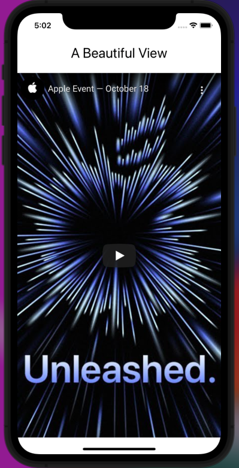
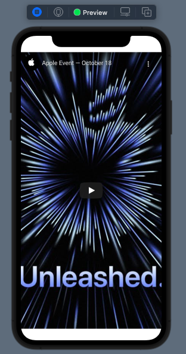
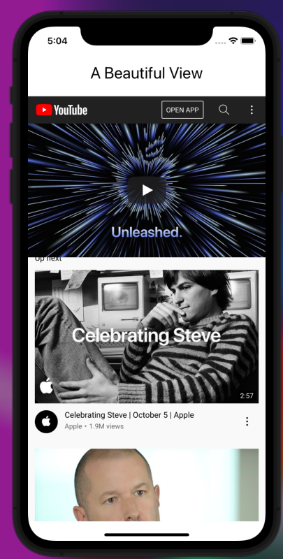

# Include YouTube Videos (or any Website) in SwiftUI!
This project demonstrates how you can include a YouTube video (or Vimeo, or any website content)  within your iOS app. 

It was originally inspired by CodeWithChris's awesome [iOS Foundations course](www.codewithchris.com). Marcelo Luprea's [Medium tutorial](https://blog.devgenius.io/embedded-youtube-videos-in-swiftui-900d3a0e80d4) 
on this same subject from January 2020 also influenced this project, and showed the trick to create YouTube videos in full-screen. 
Marcelo's tutorial does not work in iOS 14/ Xcode 12/13. This example works in both of those newer platforms. 


## Let's get started. 



First, in order to include web content within SwiftUI, we must make use of a `UIKit View`. In order to do this, create a new `SwiftUI View` 
within your project. 

Import `WebKit` at the top of your project: 
``` 
import SwiftUI
import WebKit
```

From here, make the new View struct conform to the `UIViewRepresentable` protocol.  
`struct WebSiteView: UIViewRepresentable {`

The UIViewRepresentable allows us to use UIKit views within SwiftUI. In order for this to work, we must add two required protocol stubs: a `makeUIView`  and `updateUIView` function.

Our `makeUIView` will return a `WKWebView` object. It is required that this method return a `UIKi View`. The `WKWebView` object allows us to embed, or 
display any website within our app. It's powerful. In a few clicks, it can issue web requests for a website, then pull down that information as well as grant our users
a small browser in our app with our restrictions. Note that you can edit the `WKWebViewConfiguration` object in order to control further what users can do. 

The code below will create a new browser within your app. Swap out line 24 with the YouTube URL of your choice. If you **do not want the YouTube video to display
in full screen mode**, then comment out line 27 and uncomment line 30. Of course, you can also change the URLs around those lines to display any website at all. 

Here's our code:
```
//
//  WebSiteView.swift
//  Challenge7UIKit
//
//  Created by Shepherd on 10/19/21.
//

import SwiftUI
import WebKit

/*
 Implements the view needed to display a website
 */
struct WebSiteView: UIViewRepresentable {
    
    func makeUIView(context: Context) -> WKWebView {
        
        let webConfiguration = WKWebViewConfiguration()
        
        // Create the WKWebView object with our configuration here with no frame
        let webView = WKWebView(frame: .zero, configuration: webConfiguration)
        
        // Setup our URL for the video we want from YouTube here
        let youTubeUrl = "https://www.youtube.com/watch?v=exM1uajp--A"
        
        // Make the video display full screened by replacing watch with watch_popup here
        let formattedUrl = youTubeUrl.replacingOccurrences(of: "watch", with: "watch_popup")
        
        // Use this line, if you want the user to acccess the full website
//        let formattedUrl = youTubeUrl
        
        // Create a new URL object with our YouTube video
        let myURL = URL(string: formattedUrl)
        
        // Make our HTTP GET request for the URL supplied
        let myRequest = URLRequest(url: myURL!)
        
        // Load the returned HTML/ CSS/ Website content
        webView.load(myRequest)
        
        // Return the webView here to the rest of our SwiftUI
        return webView
        
    }
    
    func updateUIView(_ uiView: UIViewType, context: Context) {
        //
    }
    
}

struct WebSiteView_Previews: PreviewProvider {
    static var previews: some View {
        WebSiteView()
    }
}

```
It produces the following in our Live Preview:


Next, we need to display this View in our `ContentView` or other main view. We do that easily within a `VStack` under our title, where we 
create an instance of our `Struct`: 
```

import SwiftUI

struct ContentView: View {
    var body: some View {
        VStack {
            Text("A Beautiful View")
                .padding()
                .font(.title)
            
            // MARK: - Call Website View
            WebSiteView()
            
        }
    }
}

struct ContentView_Previews: PreviewProvider {
    static var previews: some View {
        ContentView()
    }
}

```

The final app should look like this:


Or if you choose to use to remove the full screen features, it will show the comments/ allow people to navigate throughout the website:


Video with the partial screen with full control of the current website:

